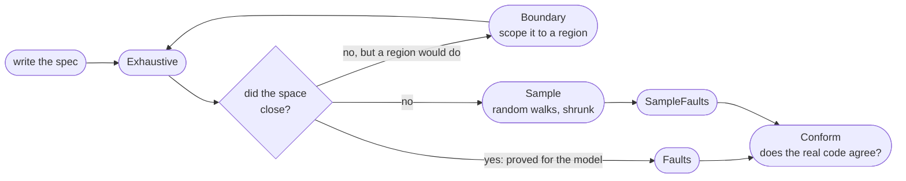
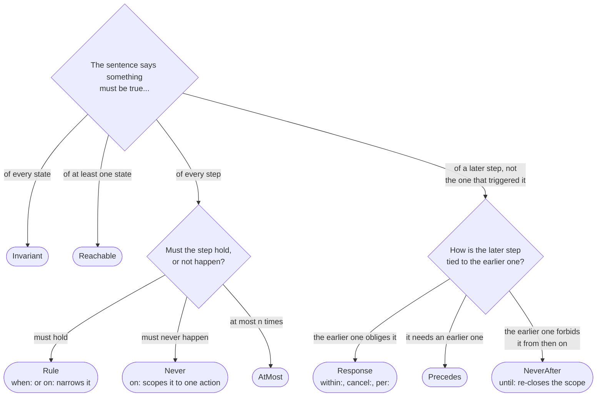
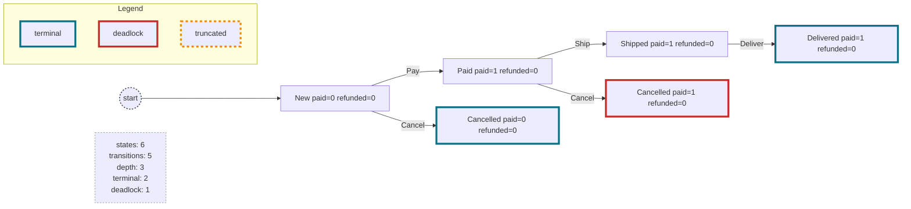

# Specification testing

`Spec` is a way to write down what a stateful thing is *supposed* to do, once, and then check it four ways:

| | what it gives you | cost |
|---|---|---|
| `Exhaustive` | enumerates the whole reachable state space; when it closes, the requirements are **proved** for the model | milliseconds for a protocol state machine |
| `Sample` | random walks with CsCheck shrinking; scales to models too big to close | the usual `iter`/`time` budget |
| `Faults` | injects declared defects and reports which requirement caught each; mutation testing for the spec | one `Exhaustive` per fault, or one walk budget with `SampleFaults` |
| `Conform` | drives a real implementation down the same walk and checks it conforms to the spec on those traces | the usual `iter`/`time` budget |

`Exhaustive` is the one that sounds impressive, but **[`Faults`](#faults-is-the-specification-any-good) is the one to
reach for second**. A proof only tells you the requirements hold; `Faults` tells you whether they were worth holding.
Writing the examples below, it repeatedly found requirements passing *for the wrong reason*; every time, the
suite was green and only the name of the catching requirement said anything was wrong. In one case it found a
requirement that could not fail at all.

How the four compose:



Not closing does not mean falling straight to `Sample`. `Boundary` still gives a proof, over a region you chose rather
than over everything, and two of the worked examples need it; *Boundary: when there is no sound abstraction* below.

**Start with [`Tests/Specs/SpecIntroTests.cs`](../Tests/Specs/SpecIntroTests.cs)**: an order that gets paid, shipped and
delivered, or cancelled and refunded, in one file with its tests. Seven reachable states and six transitions, so you
can check the tool's answer by hand. It needs no abstraction and uses only `Invariant`, `Never` and `Rule`.

The seven worked examples after it are where the technique gets interesting and the abstraction choices start to
matter. The first three were written from scratch; the last four are reimplementations of published specifications,
which means they can be checked against someone else's numbers rather than only against themselves.

Sizes below are as `SpecScaleTests.Exhaustive_Worked_Examples` reports them, and several of these models take a
parameter, so the configuration measured is named where it is not the only one:

| | what it is for | configuration | states | transitions |
|---|---|---|---|---|
| [`FixEngineSpec`](../Tests/Specs/FixEngineSpec.cs) | a real protocol document: 31 requirements over 20 abstracted inbound cases | | 2,438 | 51,569 |
| [`RefreshCacheSpec`](../Tests/Specs/RefreshCacheSpec.cs) | concurrency by explicit interleaving | | 1,445 | 6,713 |
| [`FencingSpec`](../Tests/Specs/FencingSpec.cs) | one specification in three configurations, to *choose* a design | `Fence.Every` | 583 | 3,022 |
| [`BlockingQueueSpec`](../Tests/Specs/BlockingQueueSpec.cs) | `wait`/`notify`, and the only example that **deadlocks** | 3 producers, 3 consumers, capacity 2 | 185 | 1,134 |
| [`AlternatingBitSpec`](../Tests/Specs/AlternatingBitSpec.cs) | at-most-once delivery over a lossy channel; the one `AtMost` is for | one bit, FIFO channel | 588 | 2,557 |
| [`DisruptorSpec`](../Tests/Specs/DisruptorSpec.cs) | a lock-free ring buffer whose space is genuinely infinite | 3 slots, first 20 sequences | 31,517 | 88,646 |
| [`TerminationDetectionSpec`](../Tests/Specs/TerminationDetectionSpec.cs) | Safra's EWD 998, and the largest by two orders of magnitude | ring of 3, the original's own bound | 1,520,691 | 10,507,707 |

The EWD 998 row is verified against TLC 1.7.4 running `EWD998Small.cfg` (N=3) directly: TLC gives **1,520,618
distinct states and 11,238,019 generated**, matching this spec's 1,520,691 within 73 states: the scaffold states
from the three setup actions before any protocol initial state.

The four reimplementations are checked against their originals in different ways, and it is worth knowing which is
available to you: `BlockingQueueSpec` against published trace lengths, an independent transliteration, and a *derived
closed form* for when the design is broken; `AlternatingBitSpec` against two textbook results used as predictions;
`TerminationDetectionSpec` against TLC's own published state, transition and diameter counts; `DisruptorSpec` against
the invariant its original exists to check. A prediction over a family of configurations turns out to be much harder to
satisfy by accident than any single trace.

For why the design is shaped this way, what the prior art does differently, and what writing the examples
changed, see [SpecDesign.md](SpecDesign.md).

## The requirement forms

Deliberately not full LTL. Each form is checkable incrementally in a few bytes of state, which is what makes the
exhaustive engine possible.

Which form a sentence wants:



The *later step, not the one that triggered it* branch is the one worth reading twice: a consequence that holds on the
triggering step does not discharge a `Response`, so those are a `Rule`. *Bounded response* below works through why.

These were arrived at from the worked examples, and they turn out to be a subset of the **Property Specification
Patterns** of Dwyer, Avrunin and Corbett (1999), a catalogue derived from surveying 555 real specifications. Their
occurrence family is Absence ("aka Never"), Universality ("aka Globally"), Existence ("aka Eventually") and Bounded
Existence; their order family is Precedence and Response ("aka Leads-To") plus chain variants. Each pattern is then
composed with a *scope* that fixes the region of execution it applies to: Globally, Before, After, Between, and
After-Until.

Reading the map both ways is useful. It is reassuring that the forms converged on from the worked examples are all
real cells of an empirically derived catalogue. It is less flattering that the *structure* here does not factor:
scope is glued onto individual patterns as ad-hoc `on:`, `when:`, `after:` and `until:` parameters rather than being
an orthogonal axis, which is why `NeverAfter` arrived as a surprise rather than as the obvious (Absence x After) cell.
Reading the catalogue supplied three forms no example had thought to ask for: `Reachable`, which is its Existence
pattern and stateright's `sometimes`; `AtMost`, which is Bounded Existence; and `NeverAfter`'s `until:`, below. Later
examples earned two of them back: the Alternating Bit Protocol needs `AtMost` for at-most-once delivery, and the
Disruptor and EWD998 both need `Boundary`, which is the case for reading a catalogue rather than only your own code.

The chain patterns are still missing. The scopes map further than they look, but only for Absence: `Never` is
Globally, `Precedes` is Before, `NeverAfter` is After, and `NeverAfter(until:)` is After-Until. *Between Q and R* is
deliberately absent rather than unfinished; it imposes nothing on an interval that never closes, so deciding it needs
to know whether the closing R ever arrives, and a step-local check cannot. After-Until is the strictly stronger
variant that can be decided as you go. No pattern other than Absence has a scope at all.

```csharp
.Invariant(id, quote, s => ...)                               // holds in every reachable state
.Reachable(id, quote, s => ...)                               // holds in at least one reachable state
.Rule(id, quote, (b, a) => ...)                               // holds over every step
.Rule(id, quote, when: (b, a) => ..., then: (b, a) => ...)    // same-step implication
.Rule(id, quote, on: "Tick", then: ...)                       // ... whenever one action runs
.Rule(id, quote, on: "Tick", when: ..., then: ...)            // ... and a condition holds too
.Never(id, quote, (b, a) => ...)                              // forbidden step
.Never(id, quote, on: "Tick", (b, a) => ...)                  // ... only on one action, and countable
.AtMost(id, quote, times, (b, a) => ...)                      // happens at most times per execution
.Response(id, quote, trigger, response, within, cancel, per)  // bounded response
.Precedes(id, quote, first, second)                           // second never without first
.NeverAfter(id, quote, after, never)                          // once after, thereafter never
.NeverAfter(id, quote, after, never, until)                   // ... lifted by until, back on the next after
```

The bare `Never` and the bare `Rule` apply to every step, so their coverage count would just be the number of steps
evaluated; both report `every step` instead, because a number there reads like vacuity information and is not. The
`on:` overload of `Never` counts how often that action ran, so a `Never` that could not fire says so. Write the bare
`Rule` rather than a `when:` of `true`; the claim is the same and only one of them says what it is.

`Never` is `AtMost` with a bound of zero, expressed separately because it needs no counter. Going the other way,
`AtMost("...", 3, ...)` is how you say "at most three retries" or "created exactly once", and the count so far is
part of the search state so it is proved rather than sampled; without that, a state reached once and the same state
reached for the fourth time would be one search node and the excess would go unreported.

`AtMost`, `Response`, `Precedes` and `NeverAfter` each take an optional domain and then register one instance per
element, reported as `id[element]`. Use it whenever the requirement has more than one possible subject: a single
instance carries one deadline, count or history bit, so an obligation raised by one key gets discharged by another.
Both keyed examples needed this and both produced a counterexample without it.

Two ids that clash, or an `on:`/`per:` naming an action that does not exist, are rejected before exploration
starts; see `Tests/Specs/SpecValidationTests.cs`. The failure mode for all three is a green test that proves nothing,
which is worse than a red one.

Every requirement takes an `id` and a `quote`. The quote is the sentence from the document you are implementing.
Swap the ids for your own clause numbering and the coverage table below *is* a traceability matrix, generated by
the test run rather than maintained by hand.

### The one scope, and why a state field usually beats it

`NeverAfter` takes an optional `until:` that closes the scope again, and re-opens it the next time `after` holds. Both
boundary steps are outside the scope, and it costs the same single history bit as `NeverAfter` does:

```csharp
.NeverAfter("NO-SECOND-RESEND", "Do not send a second ResendRequest while one is already outstanding.",
    after: (b, a) => a.GapOpen && !b.GapOpen,
    never: (b, a) => a.Put(Out.ResendRequest),
    until: (b, a) => !a.GapOpen)
```

Now look at that example again. `GapOpen` is already a field of the state, so the requirement the FIX model actually
ships is the plainer one, and the two are equivalent:

```csharp
.Never("NO-DUPLICATE-RESEND", "...", (b, a) => b.GapOpen && a.Put(Out.ResendRequest))
```

The field is the better statement. It costs the same search state as a scope bit, it **prints in the counterexample**
where a history bit does not, and other requirements can read it: `SEQ-TOO-HIGH-QUEUE` and `SEQ-TOO-HIGH-RESEND` both
do. Six of the seven worked examples are better off with a field, which is the Moore trick below doing the work a scope
would have done. So `until:` is for a boundary that genuinely cannot be recovered from the state, and if you reach for
it, ask first whether the state should have been carrying that fact all along.

The seventh is the cautionary tale, and it is worth reading before using `until:` at all. `AlternatingBitSpec` states
stop-and-wait with one (*between putting a frame on the wire and its acknowledgement, nothing else goes on the wire*),
and `Faults` reports the requirement as **unexercised**: no injected defect can break it. The `until` is "the
acknowledgement has moved the sender past this frame", which is the same condition that would permit a second send at
all, and a step that both closes the scope and does the forbidden thing counts as a close. So the scope is always shut
before `never` looks, and the requirement is true by construction. That is easy to write and hard to notice, which is
the strongest argument for the field: a field cannot close itself out of the way.

### The Moore trick

`Rule`, `Never`, `Response` and `Precedes` all take `(before, after)` state pairs and nothing else. That works
because the model state carries what happened: the inbound message just processed and the messages just emitted
are fields of `State`. Putting the observation in the state is what turns "when a TestRequest arrives, answer
with a Heartbeat" into a pure predicate over two values, and pure predicates over two values are what both
engines can evaluate.

It costs state space (the state is multiplied by the number of distinct observations) and it is worth it every
time.

### Bounded response, and why `per:` matters

`Response(trigger, response, within, cancel, per)` means: once `trigger` holds, `response` must hold within
`within` steps, unless `cancel` discharges it first. `per:` names the action that advances the deadline, so

```csharp
.Response("LOGOUT-COMPLETES", "...waits for the confirming Logout... terminated anyway",
    trigger:  (b, a) => a.Status == LogoutSent && b.Status != LogoutSent,
    response: (b, a) => a.Status == Disconnected,
    within: Interval + 1, per: "Tick")
```

is bounded in *clock ticks*, not in steps. Without `per:` a counterparty that keeps sending messages would burn
the deadline without any time passing, and the requirement would be nonsense.

A `Response` that fails does so several steps after the step that caused it, so the trace marks the step the obligation
was raised on rather than leaving it to be counted back to:

```
         clock=0
     1 Ring  raised here
         clock=1
     2 Tick
         clock=2
 >>  3 Tick
         clock=3
```

`NeverAfter` marks where the scope opened, and `AtMost` marks every occurrence it counted, including the one that broke
the bound - the report's number as a set of positions. A keyed instance closes over its own element, so the marks belong
to the subject that failed and not to any of the others. `Precedes` gets none: it fails only when its `second` holds
having never seen its `first`, so there is nothing earlier to point at.

**The response must land on a later step.** A response holding on the trigger step itself does not discharge the
obligation, which is stricter than LTL's leads-to, where `F` includes the present, and the opposite of `Precedes`,
where `first` and `second` on one step is satisfied. So a property whose consequence happens *in* the triggering step (
answering a TestRequest with a Heartbeat) is a `Rule`; `Response` is for the ones that take time. The worked
examples split them that way, and `Tests/Specs/SpecValidationTests.cs` pins it, because reaching for `Response` there
gets you a counterexample that reads like a tool bug.

Two further limits to be explicit about. A `per:` bound only constrains paths on which that action **recurs**; proving it
says nothing about an execution that simply stops ticking. That is the right reading of "within three heartbeat
intervals", but it does mean `CLOSED` is a weaker claim for a `per:` requirement than for an invariant. And `per:`
names an action, not an action *and its argument*, so a deadline cannot be measured in "reads of key k"; split such
an action into separately named actions if you need that.

## The proof

`Exhaustive` is a breadth-first walk of the reachable state space with a visited set. The important part is that
the search state is not just the model state:

```
node = (model state, response deadlines, precedes history)
```

Each `Response` contributes one byte: the smallest outstanding deadline, since one response discharges every
pending obligation. Each `Precedes` contributes one bit. This is the standard product construction, done for you,
and it is what makes a *temporal* property provable by state enumeration: if the product closes with no deadline
ever reaching zero unsatisfied, no path of any length can violate it.

When the frontier empties you get:

```
Spec.Exhaustive of 31 requirements
  state space CLOSED: 2,438 states, 51,569 transitions, depth 11, 131 terminal, 0 deadlock
  | Requirement             |   Triggered | Unresolved |
  | EXPECT-MONOTONIC        |  every step |            |
  | LOGON-FIRST             |         624 |            |
  | SEQ-TOO-HIGH-QUEUE      |       4,420 |            |
  | LOGOUT-COMPLETES        |         922 |            |
  ...
  | Action                  |       Fired |
  | Recv(Logon TooHigh)     |       2,258 |
  | Recv(App DupBadOrig)    |       2,258 |
  | Recv(SeqReset TooLow)   |       2,258 |
  ...
  | Reconnect               |          49 |
```

`CLOSED` is a claim about every reachable state, so it is a proof for the abstracted model. Read alongside it:

- **`Triggered`**: how many times each requirement's antecedent actually fired. A `NEVER` here means the
  requirement passed vacuously and proves nothing. This is the single most useful number in the table and no
  other property-based testing library reports it. An `Invariant`, and a `Never` or `Rule` with no antecedent at
  all, apply to every step and so have nothing to count; they read `every step` rather than a misleading number.
- **`Unresolved`** (`Sample` only): response obligations still outstanding when the trace ended. Neither pass
  nor fail: run longer traces.
- **`deadlock`**: states with no enabled action that were not declared `Terminal`. For a protocol this should be
  zero; anything else is a state the design cannot leave. When it is not zero the report prints a path to the first
  one, and `report.DeadlockTrace` is that path, because knowing a dead end exists is not the same as knowing where.
  Each step of that path also says what else was enabled where it was taken, since knowing where is still not the
  same as knowing which turn was the wrong one. `Sample` reports the same thing as `deadlocked`, counting walks rather
  than states since it keeps no visited set - which matters, because it is the engine left when a space will not close.
- **`Fired`**: one row per **(action, argument) case**, not per action. That matters: FIX has twenty inbound cases
  behind a single `Recv`, and counting per action hid a dead case behind a busy total; `NeverFired` could not see
  any of them. A `NEVER` here means that case is dead, which is the argument-level half of the vacuity story.

The tail of `BlockingQueueSpec` at `Wake.Any` with two producers, two consumers and a capacity of one:

```
     6 Get(t2->t3)  or Get(t2->t0), Get(t2->t1)
         buffer=0 waiting={p0,p1}
     7 Get(t2)      or Get(t3)
         buffer=0 waiting={p0,p1,c0}
     8 Get(t3)
         buffer=0 waiting={p0,p1,c0,c1}
         (no action enabled - trace ends here)
```

That model's bug is `notify` waking one arbitrary thread of *either* kind, and the fix is to wake one of the *opposite*
kind. Step 6 takes a same-kind wake with both opposite-kind wakes beside it, so the bug and its fix are on one line.
Step 8 offers nothing, so the trace ends on a forced move and steps 6 and 7 are where to look. `Trace<S>.ToString`
takes the same annotation as a callback for your own notes.

**Assert the size of the space, not just that it closed.** Every other assertion you can make about a passing run has
the form *"no counterexample was found"*, and a search that explored too little satisfies that just as well as one
that explored everything. `Closed`, a zero deadlock count and an empty `NeverTriggered` are all still true of a model
that quietly lost a whole class of successor, because what remains is a smaller space in which nothing goes wrong. So
pin the numbers:

```csharp
await Assert.That(report.Closed).IsTrue();
await Assert.That(report.States).IsEqualTo(2_438);
await Assert.That(report.Transitions).IsEqualTo(51_569);
```

The four oldest worked examples do this. It costs one deliberate edit whenever a model change legitimately moves the count,
which is the point, because that edit is where you ask whether the new number is the one you expected. The two are
worth pinning together: a change that prunes transitions without losing reachable states moves only the second, and
that difference is itself the evidence that a rule tightened behaviour rather than shrinking coverage.

If it does not close, the counterexample is the *shortest* path to the violation, because breadth first:

```
    Requirement: GAP-RESOLVED - triggered but no response within 4 'Tick' steps
          Spec: "A gap, once detected, is filled or the session is terminated."
         Trace:
         AwaitingLogon exp=1 out=1 idle=0 quiet=0  << -  >> -
     1 Recv(Logon TooHigh)
         LoggedOn      exp=1 out=3 gap+1 idle=0 quiet=0  << Logon TooHigh  >> Logon, ResendRequest
     2 Tick
         LoggedOn      exp=1 out=3 gap+1 idle=1 quiet=1  << -  >> -
     3 Recv(SeqReset TooLow)
         LoggedOn      exp=1 out=3 gap+1 idle=0 quiet=0  << SeqReset TooLow  >> Reject
     4 Tick
         LoggedOn      exp=1 out=3 gap+1 idle=1 quiet=1  << -  >> -
     5 Tick
         LoggedOn      exp=1 out=3 gap+1 idle=2 quiet=2  << -  >> -
 >>  6 Tick
         LoggedOn      exp=1 out=3 gap+1 idle=1 quiet=3 tr?  << -  >> TestRequest
```

## Faults: is the specification any good?

The failure mode of every specification effort is requirements that are true but weak. `Fault` declares a
deliberate defect and `Faults` injects each in turn and re-explores:

```
Spec.Faults over 17 faults
  | Fault                                           | Caught by              | Steps |
  | too low is not fatal                            | SEQ-TOO-LOW-FATAL      |     2 |
  | bad OrigSendingTime ignored instead of rejected | POSSDUP-BAD-ORIG       |     2 |
  | logon too low is not fatal                      | LOGON-TOO-LOW          |     1 |
  | outbound seqnum not advanced when sending       | OUTBOUND-ADVANCES      |     1 |
  | sequence numbers reset on reconnect             | OUTBOUND-MONOTONIC     |     2 |
  | sequence numbers drift on reconnect             | SEQNUM-PERSISTS        |     2 |
  | reset only resets the inbound side              | RESET-RESETS-BOTH      |     3 |
  | garbled consumes a seqnum                       | GARBLED-IGNORED        |     1 |
  | SequenceReset lowers seqnum                     | EXPECT-MONOTONIC       |     2 |
  | resends on every gap message                    | NO-DUPLICATE-RESEND    |     2 |
  | no heartbeat when idle                          | HB-KEEPALIVE           |     5 |
  | logout never completes                          | LOGOUT-COMPLETES       |     5 |
  | app accepted before logon                       | LOGON-FIRST            |     1 |
  | app sent before logon                           | NO-APP-BEFORE-LOGON    |     1 |
  | app sent before the second logon                | NO-APP-UNTIL-LOGGED-ON |     4 |
  | reject sent before logon                        | NO-REJECT-BEFORE-LOGON |     1 |
  | test request never times out                    | TESTREQ-TIMEOUT        |     6 |
  no declared fault exercises: EXPECT-POSITIVE, LOGON-REPLY, ...
```

A fault caught by `NOTHING` means a requirement is missing. A fault caught by a *different* requirement than you
expected means the fault or the requirement is not what you thought; the first run of the table above had
`too low is not fatal` caught by `LOGON-DUPLICATE`, because the fault predicate was broader than intended. The
trailing list is a to-do list of faults worth writing.

The `Caught by` column is worth *asserting* on rather than only reading, so `Faults` returns it typed:

```csharp
var report = FixEngineSpec.Create().Faults(TUnitX.WriteLine);
await Assert.That(report.CaughtBy("no heartbeat when idle")).IsEqualTo("HB-KEEPALIVE");
await Assert.That(report.Uncaught).IsEmpty();
```

`Results` is one row per fault, `Uncaught` the ones proved undetectable (exhaustive search closed, no violation found),
`Inconclusive` the ones where the search gave up before closing (`NOT CLOSED` in the table; these do not trigger
`throwOnUncaught`), `Unexercised` the trailing list, and `ToString()` the table. Each `SpecFaultResult` carries a
`FaultOutcome` (`Caught`, `NotDetected`, or `Inconclusive`), which makes the three outcomes unambiguous rather than
relying on a nullable `CaughtBy` plus a flag. `CaughtBy` throws on a name that was never declared: a fault renamed
without its assertion being updated would otherwise read as uncaught, which is the same green-for-the-wrong-reason
failure the column exists to catch.

That column keeps working as the model grows, which is the real reason to have it. Adding the outbound sequence
number moved `no heartbeat when idle` off `HB-KEEPALIVE` and onto `OUTBOUND-ADVANCES`: the fault stopped the
heartbeat but still consumed a number, so the arithmetic requirement caught it first and `HB-KEEPALIVE` was left
proving nothing. Every fault still had a catcher, so only the attribution gave it away.

It also settles arguments about whether a requirement is pulling its weight. `NO-APP-BEFORE-LOGON` is a
`Precedes`, and in this design nothing can send an application message before logon anyway (the `SendApp` guard
prevents it), so it looks like a requirement that can never fire. The `app sent before logon` fault shows it
catching exactly that regression at depth 1. A requirement the current design satisfies structurally is still
worth stating; `Faults` is how you tell that apart from one that is genuinely dead.

And it shows where a form runs out. `Precedes` is a claim about the whole trace, so once the session has logged on
once it is satisfied forever, including on a later connection that has not logged on yet. The
`app sent before the second logon` fault is the same defect one connection later, and `NO-APP-BEFORE-LOGON` does not
see it. Saying it per connection looks like a job for a scope, and it is not: a scope arms on its opening event, and
nothing opens the *first* connection because `AwaitingLogon` is the initial state; the trace begins already inside the
scope. So the example states it a second time as a `Never` over the state, which covers every connection including
that one.

### When the space will not close

`Faults` runs one `Exhaustive` per fault, so on a model that cannot close it cannot run at all, and that is exactly
the model whose requirements are least proven. `SampleFaults` walks each fault instead:

```csharp
var report = spec.SampleFaults(TUnitX.WriteLine, maxSteps: 30, iter: 20_000);
```

Same table and same `CaughtBy`, with two columns making weaker claims. `Steps` is the shallowest counterexample
*found* rather than the shallowest that exists, and `NOTHING` means no requirement was *seen* to catch the fault
rather than that none can; the table says so on the line below itself. A `Reachable` requirement can never appear
under `Caught by` at all, because unreachability only follows from closure. The budget is per fault, so the work is
`iter` walks times the number of faults.

It ranks candidates by the step the violation happened on rather than by the length of the trace that reached it.
That is what makes the number comparable to the proved one, and it is also why shrinking would add nothing here: a
violation at step *n* already has a minimal-length path in front of it, so the budget is better spent finding a
shallower one than simplifying this one. `FencingTests` holds the two engines against each other on a model that
does close: every fault found, by the same requirement, at the same depth.

## Abstraction is the whole skill

`Exhaustive` only closes if the model is finite and small. Making it so is the work, and it is the same work a
TLA+ or P model needs:

- **Replace values with the relations the rules are written in.** FIX never says "MsgSeqNum is 47"; it says
  "higher than expected", "lower than expected without PossDupFlag set to Y". So the model's inbound argument is
  `Seq { Expected, TooHigh, TooLow, TooLowDup, DupBadOrig }` and no sequence number is ever represented. Nothing is
  lost because the specification itself never mentions one.
- **Saturate counters.** `Expect` runs 1..3 and sticks, kept only so monotonicity can be stated. `Idle`/`Quiet`
  run 0..3 with HeartBtInt as 2 ticks, so the timing rules are exact in units of the interval.
- **State the abstraction in the requirement when it leaks.** The queue saturates at 2, so
  `SEQ-TOO-HIGH-QUEUE` says `a.Queued == Math.Min(b.Queued + 1, 2)` and carries a comment saying why. Writing
  `a.Queued > b.Queued` fails at depth 3 with a perfectly good counterexample against the abstraction rather
  than against the design, which is how you find out you have written the requirement in the wrong units.

### Pick the smallest domain that can falsify the requirement

Declare the argument domain once as a small array and both engines use it: `Exhaustive` enumerates it, `Sample`
draws from it, and `Transition.ArgIndex` hands it back to `Conform`.

One value is a domain too, and it is the one that costs you quietly. The intro example pays a single unit, so
`Paid` and `Refunded` are 0 or 1, and its requirements are written about the relationship between those two numbers
rather than about the amount. That holds for every requirement in the file but one. Give `Pay` two amounts instead
of one (`.Action("Pay", [1, 2], (o, _) => ..., (o, amount) => o with { Paid = amount })`) and only this fails:

```
    Requirement: REFUND-IS-ONE-STEP - triggered but the required consequence did not happen
          Spec: "A refund settles the order in a single movement of money."
         Trace:
         New       paid=0 refunded=0
     1 Pay(2)
         Paid      paid=2 refunded=0
     2 Cancel
         Cancelled paid=2 refunded=0
 >>  3 Refund
         Cancelled paid=2 refunded=1
```

`Refund` moves one unit, so settling 2 takes two steps and `after.Settled` is false after the first. The
requirement was not stating a business rule; it was restating the abstraction, and it passed because the domain had
one element. Two elements falsify it in three steps. Two other things move with it: the deadlock count goes from 1
to 2, because a partly refunded cancelled order is a second dead end nobody intended, and `NO-OVER-REFUND` becomes
able to see partial-refund arithmetic that one unit cannot express.

So the question to ask of every domain is not "is this realistic" but **"could this domain ever make the
requirement false"**. `Seq { Expected, TooHigh, TooLow, TooLowDup, DupBadOrig }` is five values because five is what
it takes; the fifth was added only after a review found `POSSDUP-IGNORED` forbidding a Reject the protocol requires.
Realism is not the goal and costs closure.

There is deliberately no `Gen<T>` overload. Arguments are addressed by an integer index into the domain, and that
index is what makes the rest work: `Exhaustive` enumerates it, a counterexample shrinks because a trace is a list of
small ints, `Transition.ArgIndex` recovers the typed value for `Conform`, and the coverage table can say which
argument case drove which behaviour. A generator has no index, cannot be enumerated, and so cannot close a state
space; `CLOSED` would stop meaning "every reachable state". It would also not have found the defect above any
faster: two values did that, and a million random ones prove strictly less.

### The state's own equality is the last resort

`Exhaustive` closes when it stops finding new states, and *new* means "not equal to one already seen" by `S`'s own
equality. Nothing says that has to be the compiler-generated one. Write `Equals` and `GetHashCode` yourself and you
decide what counts as a distinct state:

```csharp
readonly record struct Tagged(int Step, int Tag)
{
    public bool Equals(Tagged other) => Step == other.Step; // Tag is carried, never compared
    public override int GetHashCode() => Step;
}
```

An action that increments `Tag` without bound then closes anyway, because every value of it collapses onto one state.
`Tests/Specs/SpecValidationTests.cs` pins that.

The model state is yours, so nearly always you abstract at the source and never store the unbounded thing at all;
that is what every technique above does. The case this is for is a value whose *ordering* carries the property, where
saturating is wrong and bounding weakens the claim. `FencingSpec` bounds tokens at three grants and disables
`Acquire` there, because a saturating token would be issued twice and manufacture a counterexample against the
abstraction; the proof it gets is therefore "for all interleavings **with up to three grants**". Tokens are only ever
compared with `<`, so an `Equals` comparing each by its *rank* among the tokens present is finite however far the
counter has run, and the bound, along with the qualifier on the claim, could go.

Because a hand-written `Equals` sees the whole state, it can compare derived things like that rank. The same applies
to a `Guid` only ever compared for equality, or a timestamp only ever read as `expiry > now`: unbounded as values,
tiny as behaviour.

#### Symmetry is just a coarser equality

The same door gives you symmetry reduction, which model checkers usually expose as a dedicated feature: TLC has a
`SYMMETRY` declaration, stateright a `Representative` trait. They need one because the state is opaque to the checker.
Here it is your type, so *canonicalising interchangeable subjects in `Equals` and `GetHashCode` is the reduction*:

```csharp
// Two clients that differ only in which is which are one state.
public bool Equals(State other)
    => Holder == other.Holder && Fenced == other.Fenced
    && (One.Equals(other.One) && Two.Equals(other.Two)
     || One.Equals(other.Two) && Two.Equals(other.One));
```

`FencingSpec`'s two clients and `RefreshCacheSpec`'s two keys are both candidates, and the saving grows factorially in
the number of interchangeable subjects, which is why it is the reduction that matters at scale.

**The soundness condition is the one the feature-based tools carry too, and it is easy to get wrong: the requirements
must be symmetric as well as the state.** If any requirement names a particular subject ("client One is never
refused"), then collapsing the two hides the case where it fails, and the proof becomes false silently. Every
requirement in `FencingSpec` is phrased over `a.Actor` or a token rather than a named client, so it qualifies; if you
add one that names a client, the reduction has to go. That is a real trap and the reason none of the worked examples
ships with it: they are small enough not to need it, and the qualifier would cost more to explain than it saves.

Two warnings, in order of importance. **An `Equals` that is too coarse merges genuinely different states and the
proof becomes false, silently**; the search never visits the second one, so nothing reports anything. Too fine merely
costs states. And the canonical form is recomputed on every lookup, so an expensive one is felt across the whole
search; prefer saturating a counter, which is free and generalises the proof rather than scoping it.

### What the other examples added

Each of them contributed a technique the FIX model had no need of:

- **Make the interleaving points actions.** A load is not one step: `Read` starts it and a later `Complete` or
  `Fail` ends it, with anything at all allowed in between, so `Exhaustive` covers every interleaving instead of
  hoping a thread schedule hits the interesting one. Different guarantee from `SampleParallel`, which runs real
  threads and finds races in the *code*; this proves their absence in the *design*.
- **Make the illegal state representable.** The inverse of the usual advice. `Slot.Loads` is an `int`, not a `bool`,
  precisely so two-in-flight is a state the model can be in and `SINGLE-FLIGHT` can be *proved unreachable*. A
  `bool` makes the bug unrepresentable in the model while leaving it perfectly possible in the code.
- **Fixed slots, not a `Dictionary`.** A `Dictionary` field silently breaks value equality on the record, so
  `Exhaustive` compares by reference, never revisits a state, and explores forever. That is why both "did not close"
  notes say whether *anything* was revisited: one revisit proves the equality works, and none is the fingerprint.
- **Model a pause as a gap, not an action.** A client's GC stall is the interval between `Read` and `Write`, which
  are separate actions. Nothing has to say how long a pause may be.
- **Use nondeterminism instead of a clock when duration does not matter.** Lease expiry is a free action, not a
  timer, because the property does not depend on how long a lease lasts. Contrast the FIX model, where the bounds
  *are* the requirement and a clock is unavoidable.
- **Bound what carries ordering; saturate only what carries a threshold.** Ages and timers saturate safely because
  only their comparison to a limit matters. A fencing token is *only* its ordering, so saturating it would issue the
  same token twice and manufacture a counterexample against the abstraction. Bound it and disable the action at the
  bound; the claim becomes "for all interleavings with up to three grants".
- **Declare bound-exhaustion states `Terminal`.** When the bound stops the model rather than the design getting
  stuck, say so, or the deadlock count stops meaning anything.

## Conform: getting the proof onto the shipping code

A proof about a model is worth nothing if the code does something else. `Conform` drives the same random walk
through a real implementation and compares:

```csharp
static bool Apply(FixEngine e, Transition<State> t)
{
    switch (t.Action)
    {
        case "Recv": e.Inbound(Inbound[t.ArgIndex]); break;
        case "Tick": e.Tick(); break;
        ...
    }
    return e.State == t.After.State && e.Sent == t.After.Sent
        && e.Expect == t.After.Expect && e.GapOpen == t.After.GapOpen;
}

FixEngineSpec.Create().Conform(() => new FixEngine(), Apply, TUnitX.WriteLine);
```

The comparison is a projection, not equality: pick the fields the implementation is supposed to agree about.
`Conform` also checks the requirements on every trace, so one run covers conformance *and* the specification.

`Tests/Specs/FixEngine.cs` is a mutable, imperative engine in the shape production code actually takes, with one
planted defect (an already-processed duplicate advances the expected sequence number). It shrinks to two steps.

**The dependency runs implementation → specification → tests, and never back.** The engine owns the vocabulary (the
message kinds, the sequence relations, what a step emits, the connection status), and the specification does
`using static Tests.FixEngine;` to reach them. Get this backwards and the implementation cannot be shipped without
its own test specification, which defeats the point of `Conform`. The one honest leak is the other way: the engine's
counters saturate, which is a concession to the abstraction rather than something a real engine would do, and its
`Cap` says so.

## How big a model can be

Measured by `Tests/Specs/SpecScaleTests.cs`, not estimated:

| | |
|---|---|
| Throughput | ~7M transitions/s single threaded on a narrow state with four requirements, ~2.7M on a wide one with fourteen |
| Memory | ~170 bytes per state for a 12-byte `S`, ~305 for a 48-byte one; see [Keep `S` narrow](#keep-s-narrow-not-just-bounded) |
| Default `maxStates` | 10,000,000: about 2GB and 4s when reached with a narrow state, about 3GB with a wide one |
| The worked examples | 185 to 1,520,691 states, 0.2ms to 2.5s each |

Three things follow. First, **the binding constraint is memory, not CPU**; the default is set where it is because
3GB is about the most a library should consume before giving up and telling you why, not because the search would be
slow past it.

Second, the largest worked example is 1.5 million states, which is 15% of that default rather than the comfortable
margin the first six enjoy. So the default is not arbitrary headroom: a real specification has already come within an
order of magnitude of it, and the one other real specification we know of (a lease-and-handoff protocol elsewhere in
the same organisation as the author) closes at 1,008,264. Anything of that shape should expect to think about the
bound rather than ignore it.

Third, and still true of six of the seven: if a model is slow the answer is almost always a leaked abstraction or a
wide state rather than the engine.

### When the space does not close

Hitting `maxStates` proves nothing: the report says `NOT closed`, and *which* states it gave up on is an artefact of
breadth-first order rather than anything about your model. What it can tell you is where the blow-up came from, by
counting distinct values per state field across the states it did reach:

```
gave up at 2,000 states - widest state fields are Counter (335 values), Small (3 values), Flag (2 values);
saturate or bound the widest, or drop from the state's Equals and GetHashCode whatever the behaviour never
reads, or raise maxStates knowing it costs roughly 200 bytes per state for a narrow state and half again for
a wide one
```

`Counter` is the field to fix. This works by parsing the printed state, so it needs the record's generated
`ToString` shape: a state with a hand written `ToString` gets the note without the field breakdown rather than a
guess.

When *nothing at all* was revisited the note adds that too, because a state whose value equality is broken (a
`Dictionary` or array field on a record) explores a tree forever and so revisits nothing. It is worded as a check
rather than a diagnosis, since an honestly infinite model revisits nothing either. The same signal on a run that
*did* close says the reachable space is a tree, which is expected of a model that only advances and suspicious of
anything else. `report.Revisits` is the count both notes turn on, if you want to assert on it directly.

### Boundary: when there is no sound abstraction

Naming the field is enough when it *can* be saturated. When it cannot, `Boundary` replaces truncation with a scoped
claim: states reached from inside it are checked as normal, they are simply not expanded.

```csharp
Spec.From(0)
.Action("Inc", i => i + 1)          // no guard, so the space is infinite
.Boundary(i => i <= 5)
.Exhaustive();
```

```
state space CLOSED within boundary: 6 states, 6 transitions, depth 5, 0 terminal, 0 deadlock, 1 outside
```

Add `Never("NO-SIX", "the counter never reaches six", (b, a) => a == 6)` to that specification and the violation is
still found, at six steps, because **the transition that leaves the boundary is still checked**. Only the expansion
of the state it reached is given up. That is the difference between a boundary and a smaller `maxStates`: the
explored set is exactly
the reachable states that satisfy the predicate, regardless of the order you walk them, so what you proved is a property of the model
rather than of the search order, and it is a sentence you can put in a document: *no violation is reachable
without leaving the boundary*.

One conclusion a boundary is not allowed to support. `Reachable` works by closure: a state never seen in a closed
space is unreachable. With states pruned that no longer follows, so an unheld `Reachable` becomes a note rather
than a failure. `Faults` gets the same caveat, since a fault caught by `NOTHING` may be caught outside. And the
boundary must admit the initial state, or everything is pruned and the report reads like a proof of one state;
that is rejected up front.

Reach for saturation first. `Math.Min(idle + 1, Cap)` makes every higher value *the same state*, which generalises
the proof; a boundary only scopes it. Saturation is strictly stronger where you can find one; the boundary is for
when you cannot. It applies to `Exhaustive` and `Faults`, not to `Sample` or `Conform`, whose walks are bounded by
their step count and so cannot fail to terminate anyway.

### Threads

`Exhaustive` takes a `threads` argument that defaults to **1**, and the default path fuses expansion and insertion
so an edge is consumed while still in registers. Above one thread each frontier level is expanded in parallel into a
buffer and then inserted sequentially in source order. Only the user delegates run in parallel; the visited set is
never touched off the main thread, so the state count, the counterexample chosen among several at the same depth, and
every coverage number are identical however many threads ran; `Tests/Specs/SpecScaleTests.cs` asserts exactly that, for the
report and for the counterexample.

That holds for a failing run too, which took a fix. A violation stops the walk mid-node, and the parallel path has
already expanded that whole node, so the sequential path finishes evaluating the node's remaining edges for counting
and stops only the inserting. Without it an action fired only after the violation read `NEVER` on one thread and a
number on many, and `NeverFired` is public API. It costs one node of delegate calls on a run that is failing anyway.
`Tests/Specs/SpecScaleTests.cs` compares whole reports for a model whose violating action is the *first* declared,
because a model where it is the last passes either way.

It is opt in because the numbers say it should be. On 22 cores, four runs of
`SpecScaleTests.Parallel_Speedup` over the same 50,700-transition model:

| delegate cost | median speedup | range |
|---|---|---|
| free (a comparison and a `with`) | **0.78x** | 0.71 – 0.93 |
| moderate (~20 adds) | 1.21x | 0.91 – 1.49 |
| expensive (~200 adds) | **2.12x** | 1.46 – 3.16 |

Free delegates are slower on every sample, not break-even: buffering a level and handing it out costs more than
expanding it in place, and that cost does not go away when there is nothing to overlap it with. This is the reason
`threads` defaults to 1 rather than to the core count.

The ceiling is the sequential visited set: Amdahl, not implementation. So `threads` is worth reaching for only
when your guards, transitions and requirement predicates are genuinely costly, and it comes with a real condition:
above one thread those delegates must be **thread safe**, not merely pure. A memoisation cache inside a transition
would corrupt the engine that proves your system correct, nondeterministically. On one thread it cannot.

## Requirements on `S`

- Immutable with value equality: a `record` or `record struct`. `Exhaustive` hashes states to detect revisits;
  with reference equality it explores a tree forever. If the space fails to close and no state was ever revisited,
  the report says so and names value equality as a thing to check.
- Small. Saturate every counter. If `Exhaustive` gives up at `maxStates` the note names the widest fields, so start
  with those; then declare a `Boundary`, or fall back to `Sample`, which has no such requirement.
- Transitions must be pure. They are called many times per state, and by two different engines.

Limits: 16 `Response` and `AtMost` requirements **between them**, each costing one byte of search node, and 64
`Precedes` and `NeverAfter` between them, each costing one bit. Both budgets are shared pools, so twelve `Response`
and no `AtMost` is fine. `within` and `times` are at most 254. The `over` overloads spend one slot per element, which
is the easy way to cross a limit without noticing.

### Keep `S` narrow, not just bounded

"Small" above is about how many *distinct values* `S` has, which decides whether the space closes. Its **width in
bytes** is a separate thing and it decides how fast the space is explored. Every guard, transition and requirement
predicate is a `Func<S, ...>`, so `S` is passed by value and copied on each one, and there are a lot of each. A state
expanded from a model with a dozen requirements and thirty argument cases copies `S` upwards of fifty times.

Measured on four models that are behaviourally identical (same actions, same requirements, same 97,336 states and
285,660 transitions), differing only in how many *unused* `int` fields the state carries:

| `S` | median | ns/transition |
|---|---|---|
| 3 ints (12 bytes) | 27.0ms | **94.7** |
| 8 ints (32 bytes) | 29.7ms | 103.9 |
| 16 ints (64 bytes) | 41.8ms | 146.4 |
| 24 ints (96 bytes) | 49.7ms | **174.1** |

**1.84x for 84 bytes of padding that changes no behaviour**, or roughly a nanosecond per byte per transition. So when a
model is slower than it should be, count the bytes before suspecting the engine. Packing several small fields into one
`int` is the usual fix (a bit per node rather than a `bool` per node, a nibble per counter rather than an `int`) and
both `TerminationDetectionSpec` and `BlockingQueueSpec` do it for exactly this reason. Do not take it further than
stays readable: a worked example is worth more legible than 8% faster.

This is not something the library can fix for you. Taking `S` by `in` reference throughout would save the copies and
cost every lambda in every specification its readability, which is the wrong trade for a tool whose point is that the
specification reads like the document it came from.

## Drawing a small model

`spec.Mermaid()` returns the reachable state graph as a Mermaid flowchart. It marks the initial state, adds a small
summary and legend, and styles intended ends, dead ends and cut-off states differently, so `Terminal` and `deadlock`
are visible without reading a table:

```csharp
File.WriteAllText("order.md", "```mermaid\n" + Create().Mermaid() + "```\n");
```

Arrows are one per pair of states, not one per transition. Picking the smallest falsifying domain routinely sends
several arguments to the same state, so an `Enqueue` over `[1, 2, 3]` against a queue abstracted to its count draws one
arrow labelled `Enqueue(1,2,3)`, and two actions arriving together read `Cancel, Timeout`. The summary counts
transitions, the number the walk took, so it can exceed the arrows you can see.

GitHub and Visual Studio render `mermaid` fences directly in Markdown. When documenting a model it is often worth
showing both the generated Mermaid text and the graph it renders. Here is the non-refundable variant of the order
lifecycle from `SpecIntroTests.cs`, where the paid-then-cancelled state has no enabled action:

```text
flowchart LR
  classDef initial stroke:#495057,stroke-width:2px,stroke-dasharray: 3 3;
  classDef terminal stroke:#0b7285,stroke-width:4px;
  classDef deadlock stroke:#c92a2a,stroke-width:4px;
  classDef truncated stroke:#f08c00,stroke-width:4px,stroke-dasharray: 5 5;
  classDef note stroke:#868e96,stroke-dasharray: 3 3;
  start((start));
  start --> n0;
  class start initial;
  n0 -->|"Pay"| n1;
  n0 -->|"Cancel"| n2;
  n0["New       paid=0 refunded=0"];
  n1 -->|"Ship"| n3;
  n1 -->|"Cancel"| n4;
  n1["Paid      paid=1 refunded=0"];
  n2["Cancelled paid=0 refunded=0"];
  class n2 terminal;
  n3 -->|"Deliver"| n5;
  n3["Shipped   paid=1 refunded=0"];
  n4["Cancelled paid=1 refunded=0"];
  class n4 deadlock;
  n5["Delivered paid=1 refunded=0"];
  class n5 terminal;
  info["states: 6<br/>transitions: 5<br/>depth: 3<br/>terminal: 2<br/>deadlock: 1"];
  class info note;
  subgraph legend["Legend"]
    legendTerminal["terminal"];
    legendDeadlock["deadlock"];
    legendTruncated["truncated"];
  end
  class legendTerminal terminal;
  class legendDeadlock deadlock;
  class legendTruncated truncated;
```

And the same text as a rendered diagram:



The red-outlined state in the graph is the finding: a customer who paid and then cancelled has no recourse.
`Exhaustive` reports it as a deadlock count (1); this says which.

It walks the space itself rather than reusing `Exhaustive`, which keeps only a spanning tree of parent links (enough
to rebuild one path, not the graph) and it evaluates no requirements: the picture is for understanding a model, and
`Exhaustive` is for proving things about it. It gives up at 200 states by default, because a picture stops being
useful long before a proof does. The seven-state intro example is the one where this beats the table, and it earned
its keep immediately: it showed three terminal nodes where the test author had assumed two, because cancelling an
order *before paying* is settled as well.

`maxStates` is not the only ceiling. Mermaid refuses a diagram whose source exceeds its `maxTextSize`, 50,000
characters by default, and shows an error in place of the picture rather than a truncated one. Reaching that at 200
states needs 250 characters a state, which takes a wide state or a fanned-out argument domain; the graph above runs at
55. If a fence renders as an error instead of a graph, lower `maxStates`.
